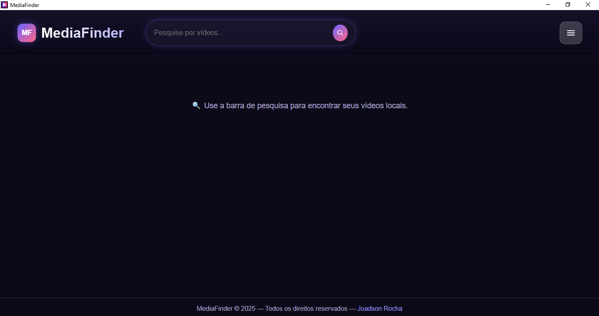
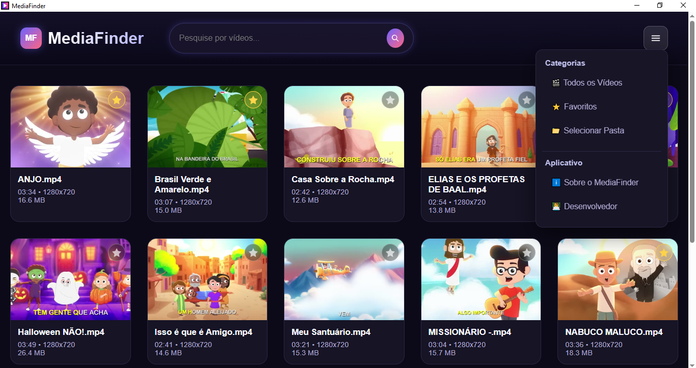
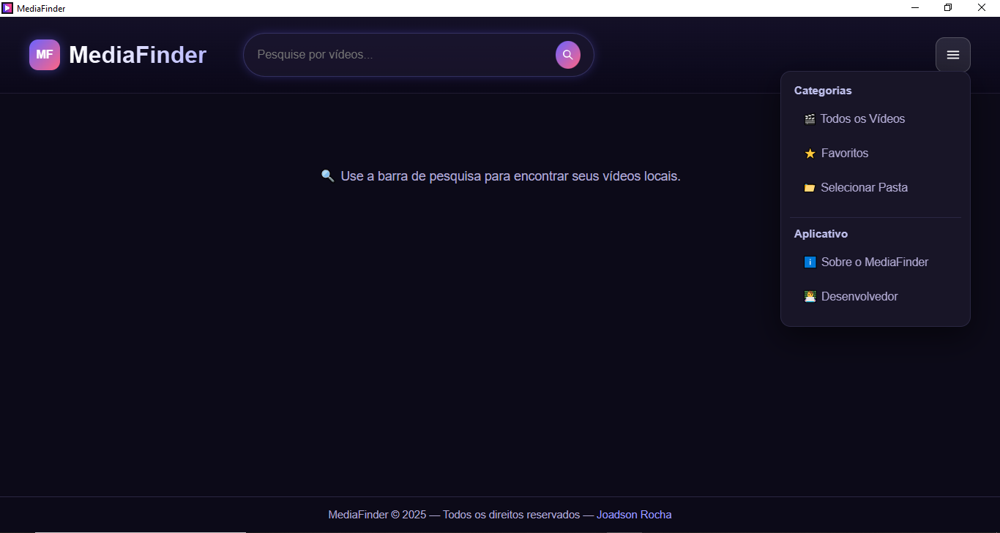

# 🎬 MediaFinder — Organizador e Reprodutor de Vídeos Locais

MediaFinder é um aplicativo desktop desenvolvido para **organizar** e **assistir vídeos armazenados localmente**, com busca inteligente, exibição de capas automáticas e uma interface simples e focada.

---

## ✨ Funcionalidades
- 🧭 Busca rápida por vídeos na sua coleção local  
- 🖼️ Carregamento automático de capas de vídeo (thumbnail)  
- 🖥️ Reprodução integrada com interface limpa  
- 📂 Suporte a diferentes formatos de vídeo locais  
- 🎨 Layout responsivo e moderno (Windows/macOS/Linux – dependendo da versão)  

---

---

### 📸 Screenshots

#### 🏁 Tela Inicial, Vídeos e Configurações
| 🏠 Tela Inicial | 🎞 Tela de Vídeos | ⚙ Tela de Configurações |
|----------------|------------------|--------------------------|
|  |  |  |
 🛑 **Observação técnica:** Se as miniaturas dos vídeos não aparecerem ou houver falhas de carregamento, verifique se o FFmpeg está corretamente instalado e acessível pelo sistema.
---
👨‍💻 Autor

Joadson Rocha
🔗 https://joadsonrocha.github.io

🐙 https://github.com/JoadsonRocha
---

