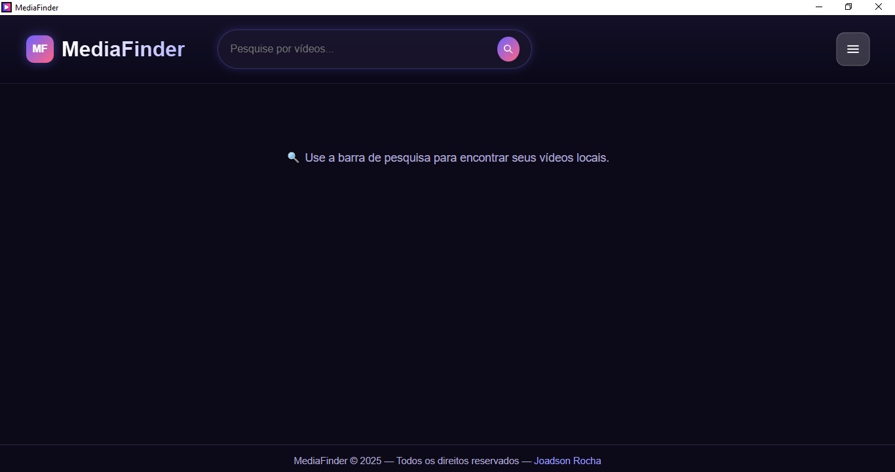
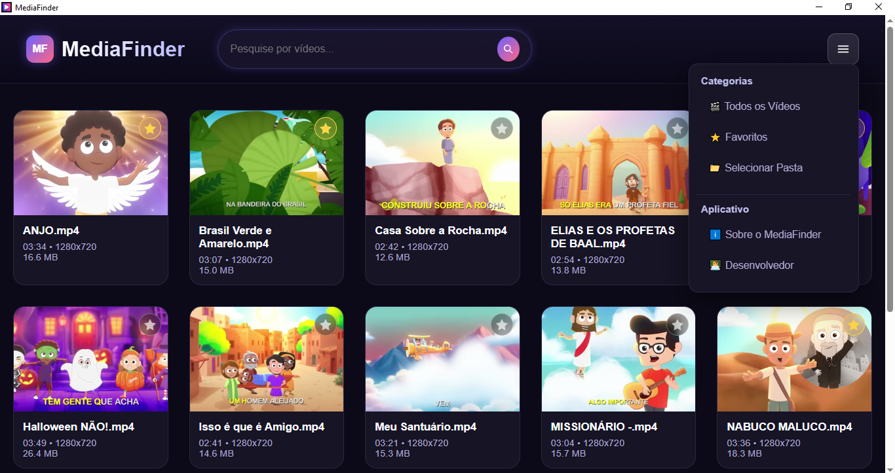
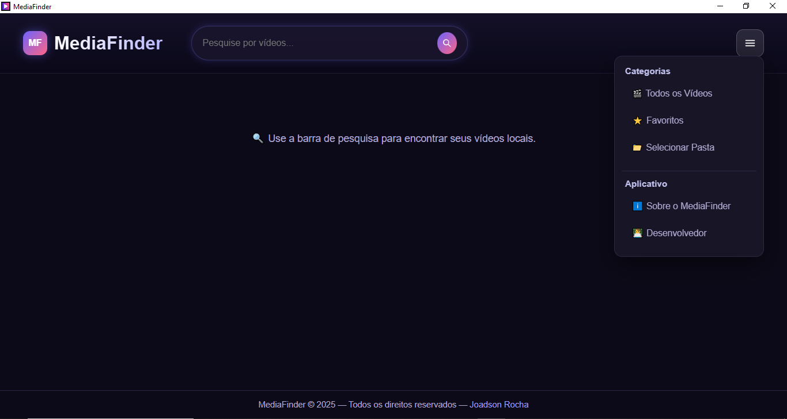

<div align="center">

# 🎬 MediaFinder

### Smart Local Video Organizer and Player

[](./LICENSE.md)
[](https://www.electronjs.org/)
[](https://nodejs.org/)
[](https://www.microsoft.com/)
[](./package.json)

<br />

**[🇧🇷 Português](./README.md)** &nbsp;|&nbsp; **[🇺🇸 English](./README_EN.md)**

<p align="center">
  <strong>MediaFinder</strong> is a modern desktop application designed to streamline how you organize, search, and watch videos stored on your local machine. Powered by automatic thumbnail generation with FFmpeg, a built-in modal video player, and real-time instant search, your media collection comes alive inside a sleek Dark Glassmorphism interface.
</p>

</div>

---

## 📸 Visual Showcase

<div align="center">

| 🏠 Home View | 🎞 Video Library & Thumbnails | ⚙ Folder Settings |
| :---: | :---: | :---: |
|  |  |  |

</div>

---

## ✨ Key Features

- ⚡ **Real-Time Instant Search**: Filter hundreds of video files as you type with a high-performance 250ms debounce mechanism.
- 🖼️ **Intelligent Automatic Thumbnails**: Frame extraction powered by FFmpeg, cached by unique MD5 path hashes to prevent filename collisions and ensure lightning-fast reloads.
- 🎬 **Integrated Modal Video Player**: Watch videos directly inside the application with responsive controls and keyboard shortcuts (`Space` for play/pause, `ESC` to close).
- 🚀 **Windows OS Integration**:
  - *External Player*: Open any file directly in your operating system's default media player.
  - *Show in Folder*: Reveal and highlight the file inside Windows File Explorer with a single click.
- ⭐ **Favorites System**: Bookmark your favorite videos with persistent local storage and quickly access them through the dedicated favorites tab.
- 🔀 **Advanced Sorting Options**: Sort your media library by:
  - 🔤 Name (A - Z and Z - A)
  - 📅 Modified Date (Newest first)
  - 💾 File Size (Largest to smallest)
  - ⏱️ Video Duration (Longest to shortest)
- 📂 **Multi-Format & Subfolder Support**:
  - Supports `.mp4`, `.mkv`, `.avi`, `.webm`, `.mov`, `.wmv`, `.m4v`, `.flv`, `.ts`, `.3gp`, `.mpg`, `.mpeg`.
  - Toggle recursive subfolder scanning on and off via the options menu.
- 🛡️ **100% Private and Offline**: Your files never leave your computer. Zero telemetry, zero ads, and no cloud dependency or account required.

---

## 🛠️ Tech Stack

Engineered with a focus on lightness, high responsiveness, and visual excellence:

- **[Electron](https://www.electronjs.org/)** — Cross-platform desktop framework leveraging web standards.
- **[Node.js](https://nodejs.org/)** — High-speed filesystem I/O, IPC architecture, and child process management.
- **[HTML5 & Vanilla CSS](https://developer.mozilla.org/en-US/docs/Web/CSS)** — Modular Design System with Glassmorphism, smooth micro-animations, and Dark Mode.
- **[JavaScript (ES6+)](https://developer.mozilla.org/en-US/docs/Web/JavaScript)** — Reactive DOM updates, clean async state management, and event handling.
- **[Fluent-FFmpeg](https://github.com/fluent-ffmpeg/node-fluent-ffmpeg)** — Bridge for FFmpeg & FFprobe to capture video thumbnails and parse stream metadata.

---

## 📁 Project Architecture

```text
MediaFinder/
├── app/                      # Renderer Process & User Interface (Frontend)
│   ├── index.html            # Accessible semantic layout
│   ├── renderer.js           # State management, modal player & filters
│   ├── style.css             # Design system with dark theme & animations
│   └── mediaFinder.ico       # Official application icon
├── main.js                   # Electron Main Process & IPC handlers
├── preload.js                # Secure ContextBridge IPC bridge
├── package.json              # Project manifest and build scripts
├── .gitignore                # Git ignore patterns
├── LICENSE.md                # GNU General Public License v3.0
├── README.md                 # Documentation in Portuguese
└── README_EN.md              # Documentation in English
```

---

## 🚀 Getting Started

### Prerequisites
Make sure you have installed on your computer:
- **[Node.js](https://nodejs.org/)** (v18 or newer recommended)
- **Git**

### Installation & Run

1. **Clone the repository:**
   ```bash
   git clone https://github.com/JoadsonRocha/MediaFinder.git
   cd MediaFinder
   ```

2. **Install dependencies:**
   ```bash
   npm install
   ```

3. **Start the application in development mode:**
   ```bash
   npm start
   ```

4. **Build Windows executable bundle:**
   ```bash
   npm run dist
   ```
   *The installer `.exe` and portable release will be generated inside the `dist/` directory.*

---

## ⚙️ FFmpeg Setup

**MediaFinder** includes smart automatic detection for FFmpeg:
- If FFmpeg is already available in your Windows `PATH`, the application automatically connects to it.
- If FFmpeg is not found, the app **continues to work smoothly**: listing, searching, filtering, and playing your videos, displaying elegant custom SVG fallback covers.

> [!TIP]
> **Quick FFmpeg installation on Windows:**
> Open PowerShell as Administrator and run:
> ```powershell
> winget install Gyan.FFmpeg
> ```
> Or download the binaries from [ffmpeg.org](https://ffmpeg.org/download.html) and place the executables (`ffmpeg.exe` and `ffprobe.exe`) in a `ffmpeg/bin/` folder at the project root.

---

## 📄 License

This software is released under the **GNU General Public License v3.0 (GNU GPLv3)**. See [LICENSE.md](./LICENSE.md) for full license terms and open-source permissions.

---

## 👨‍💻 Author

<div align="center">

**Joadson Rocha**  
*Full Stack & Desktop Software Developer*

[](https://joadsonrocha.github.io)
[](https://github.com/JoadsonRocha)
[](https://www.linkedin.com/in/joadsonrocha/)

</div>
